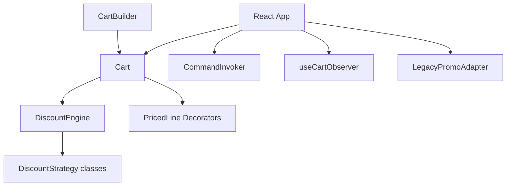

# E-Commerce Cart — Design Patterns (Evolving System)

**Selected topic: D — E-Commerce Cart**

I chose this topic because discount rules are a clear real-world pain point: every new promotion type tends to land in one `if` block and breaks something else. The cart is easy to demo in React while showing a full evolution from naive code → Creational → Structural → Behavioral patterns.

A React + TypeScript storefront that grew phase-by-phase from a **naive cart** (discounts hardcoded in one class) to an **extensible** design using Gang of Four patterns.

---

## Current status

| Phase | Branch | Status |
|-------|--------|--------|
| 0 — Naive baseline | `main` (history) | Complete |
| 1 — Creational | `phase-1` | Complete |
| 2 — Structural | `phase-2` | Complete |
| 3 — Behavioral | `phase-3` | Complete |
| **Final** | `main` | All phases merged |

---

## What it does

- Browse a product catalog and add items to the cart  
- Optional per-line **gift wrap** and **extended warranty** (Decorator)  
- **Student**, **loyalty**, **coupon**, and **partner** promotions  
- **Black Friday** toggle demonstrates **OCP** — new discount without editing old code  
- **Undo** for add-item and student-discount actions (Command)  

---

## Design patterns used

| Phase | Branch | Patterns |
|-------|--------|----------|
| 0 | `main` (baseline) | — |
| 1 | `phase-1` | Factory Method, Builder |
| 2 | `phase-2` | Decorator, Adapter |
| 3 | `phase-3` | Strategy, Observer, Command |

Details: [PATTERNS.md](./PATTERNS.md) · Problem analysis: [PROBLEMS.md](./PROBLEMS.md)

---

## Architecture (final)



Full diagram: [docs/diagrams/phase3-architecture.md](./docs/diagrams/phase3-architecture.md)

---

## Run locally

```bash
npm install
npm run dev      # http://localhost:5173
npm run build    # production build
npm test         # Vitest — discount engine / OCP tests
```

---

## Repository structure

```
├── README.md
├── PATTERNS.md
├── PROBLEMS.md
├── src/
│   ├── domain/          # Cart, Product
│   ├── creational/      # Phase 1
│   ├── structural/      # Phase 2
│   ├── behavioral/      # Phase 3
│   └── hooks/
├── docs/
│   ├── diagrams/
│   └── ai-log/
└── .github/workflows/ci.yml
```

---

## Branches

| Branch | Content |
|--------|---------|
| `main` | Merge target — final merged project |
| `phase-1` | Creational patterns |
| `phase-2` | + Structural patterns |
| `phase-3` | + Behavioral patterns + CI |

**Final merge:** `phase-3` merged into `main` (all patterns + CI live on `main`).

---

## CI

GitHub Actions runs on push/PR: `npm ci` → `npm run build` → `npm test`.

---

## AI usage

Documented per phase in `docs/ai-log/phase1.md`, `phase2.md`, `phase3.md` (prompts, reflections, corrections).

---

Academic project — Software Design Patterns 2025–2026.
