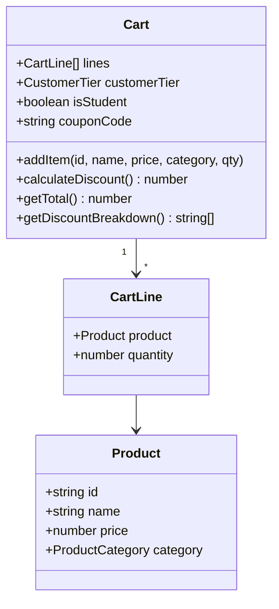

# Phase 0 — Class diagram (naive)

```mermaid
classDiagram
    class Product {
        +string id
        +string name
        +number price
        +ProductCategory category
    }

    class Cart {
        +CartLine[] lines
        +CustomerTier customerTier
        +boolean isStudent
        +string couponCode
        +addItem(id, name, price, category, qty)
        +calculateDiscount() number
        +getTotal() number
        +getDiscountBreakdown() string[]
    }

    class CartLine {
        +Product product
        +number quantity
    }

    Cart "1" --> "*" CartLine
    CartLine --> Product
```

**Note:** `calculateDiscount()` contains all promotion rules (student, bulk, loyalty, coupons, electronics promo) — the main design debt for Topic D.
