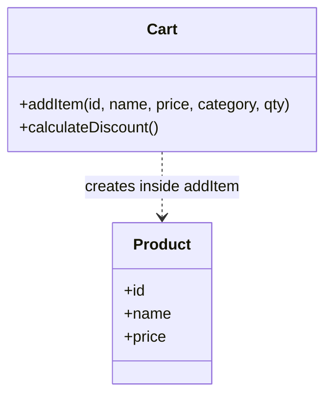
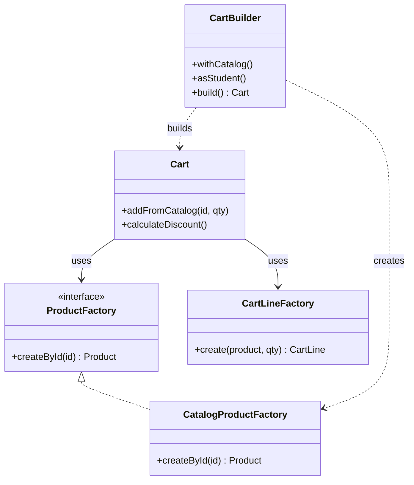

# Phase 1 — Class diagram (Creational)

## Before (Phase 0)

```mermaid
classDiagram
    class Cart {
        +addItem(id, name, price, category, qty)
        +calculateDiscount()
    }
    class Product {
        +id
        +name
        +price
    }
    Cart ..> Product : creates inside addItem
```

## After (Phase 1)

```mermaid
classDiagram
    class ProductFactory {
        <<interface>>
        +createById(id) Product
    }
    class CatalogProductFactory {
        +createById(id) Product
    }
    class CartLineFactory {
        +create(product, qty) CartLine
    }
    class CartBuilder {
        +withCatalog()
        +asStudent()
        +build() Cart
    }
    class Cart {
        +addFromCatalog(id, qty)
        +calculateDiscount()
    }

    ProductFactory <|.. CatalogProductFactory
    Cart --> ProductFactory : uses
    Cart --> CartLineFactory : uses
    CartBuilder ..> Cart : builds
    CartBuilder ..> CatalogProductFactory : creates
```
