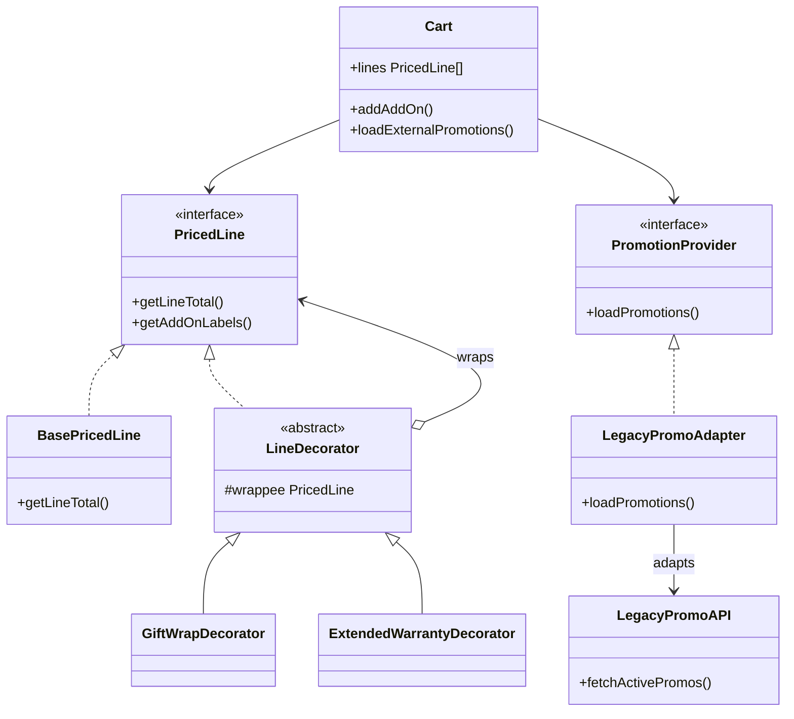
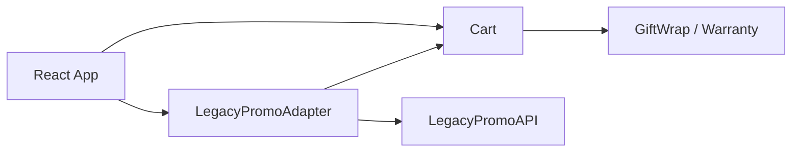

# Phase 2 — Class diagram (Structural)

```mermaid
classDiagram
    class PricedLine {
        <<interface>>
        +getLineTotal()
        +getAddOnLabels()
    }
    class BasePricedLine {
        +getLineTotal()
    }
    class LineDecorator {
        <<abstract>>
        #wrappee PricedLine
    }
    class GiftWrapDecorator
    class ExtendedWarrantyDecorator

    class PromotionProvider {
        <<interface>>
        +loadPromotions()
    }
    class LegacyPromoAdapter {
        +loadPromotions()
    }
    class LegacyPromoAPI {
        +fetchActivePromos()
    }
    class Cart {
        +lines PricedLine[]
        +addAddOn()
        +loadExternalPromotions()
    }

    PricedLine <|.. BasePricedLine
    PricedLine <|.. LineDecorator
    LineDecorator <|-- GiftWrapDecorator
    LineDecorator <|-- ExtendedWarrantyDecorator
    LineDecorator o--> PricedLine : wraps

    PromotionProvider <|.. LegacyPromoAdapter
    LegacyPromoAdapter --> LegacyPromoAPI : adapts
    Cart --> PricedLine
    Cart --> PromotionProvider
```

## Architecture (feature flow)

```mermaid
flowchart LR
    UI[React App]
    Cart[Cart]
    Decorators[GiftWrap / Warranty]
    Adapter[LegacyPromoAdapter]
    API[LegacyPromoAPI]

    UI --> Cart
    Cart --> Decorators
    UI --> Adapter
    Adapter --> API
    Adapter --> Cart
```
