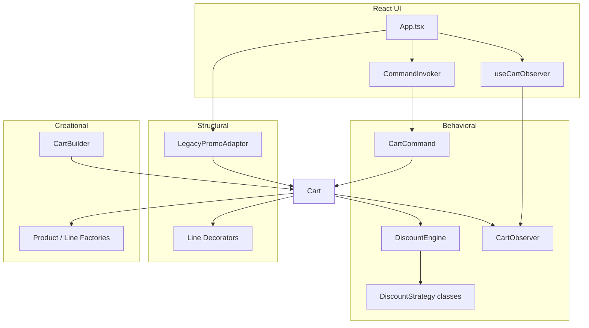

# Phase 3 — Final architecture

## Pattern map (all phases)

| Phase | Patterns |
|-------|----------|
| 0 | None (naive) |
| 1 | Factory Method, Builder |
| 2 | Decorator, Adapter |
| 3 | Strategy, Observer, Command |
